<div align="center">

<!-- Batman working at Oracle computer console GIF -->


<h1>Anish Reddy</h1>

<!-- Animated Typing Terminal (Oracle Zone) -->


<!-- Custom animated Batmobile driving left to right -->


<!-- System Statistics Badges -->
<p align="center">
  
  
</p>

*“Vigilant in research. Precise in code. Driven by data.”*

---

<div align="left">

Welcome to the secure terminal matrix of Anish Reddy. Here, I design robust machine learning models, engineer automated AI agents, and build responsive applications. Combining mathematical precision with operational execution.

</div>

</div>

---

## 📂 MISSION BRIEFING

```yml
SYS.LOC: Gotham City // 40.7128° N, 74.0060° W
SYS.ROLE: Lead AI / Machine Learning Architect
SYS.INTEL: Turning complex research papers into production systems
SYS.STATUS: Active Operations / Vigilant Coding
```

### ⚡ CURRENT OPERATIONS

- **Agentic Architectures**: Designing multi-agent orchestration frameworks using LangChain and custom Model Context Protocol (MCP) integrations to automate complex decision-making processes.
- **SmartCity TwinGPT**: Building a digital-twin system using Large Language Models to simulate urban operations, municipal services, and resource allocations in real-time.
- **Anomalous Intrusion Detection**: Refining RansomShield's machine learning model to recognize CPU and Disk I/O anomaly patterns, preventing malicious system takeovers.

### 🔍 INTEL FOCUS AREAS

- **Continuous MLOps**: Packaging ML model environments inside Docker and automating remote deployments to AWS, Render, and Vercel.
- **Retrieval-Augmented Generation (RAG)**: Developing context-aware search pipelines utilizing Supabase vector databases and advanced document parsers.

### 🤝 COOPERATIVE PROTOCOL

- Open to collaborating on scalable AI systems, self-correcting agent loops, and high-performance ML pipelines.
- Welcoming contributions and partnerships on open-source toolkits that optimize deep learning runtimes and data engineering pipelines.

---

## 🛠️ TECH ARSENAL

<div align="center">
  <table style="border: 1px solid #1f2d3d; border-collapse: collapse; width: 100%;">
    <tr>
      <th align="left" style="padding: 10px; border-bottom: 2px solid #8E9AAF; color: #8E9AAF; font-family: monospace;">📂 SECTOR</th>
      <th align="left" style="padding: 10px; border-bottom: 2px solid #8E9AAF; color: #8E9AAF; font-family: monospace;">🛠️ ARSENAL MODULES</th>
    </tr>
    <tr>
      <td style="padding: 10px; font-weight: bold; font-family: monospace; color: #8E9AAF;">Core Architecture</td>
      <td style="padding: 10px;">
        
        
        
        
        
      </td>
    </tr>
    <tr>
      <td style="padding: 10px; font-weight: bold; font-family: monospace; color: #8E9AAF;">Intelligence Engines</td>
      <td style="padding: 10px;">
        
        
        
        
        
        
      </td>
    </tr>
    <tr>
      <td style="padding: 10px; font-weight: bold; font-family: monospace; color: #8E9AAF;">Services &amp; APIs</td>
      <td style="padding: 10px;">
        
        
        
        
      </td>
    </tr>
    <tr>
      <td style="padding: 10px; font-weight: bold; font-family: monospace; color: #8E9AAF;">Tactical Deployments</td>
      <td style="padding: 10px;">
        
        
        
        
        
        
      </td>
    </tr>
  </table>
</div>

---

## 🚀 FLAGSHIP DEPLOYMENTS

<div align="center">
  <table border="0" cellpadding="10" cellspacing="10" width="100%">
    <tr>
      <td width="50%" valign="top" style="border: 1px solid #1f2d3d; border-radius: 8px; padding: 15px; background: #0B0F19;">
        <h3 style="color: #8E9AAF; margin-top: 0; font-family: monospace;">🏙️ SmartCity TwinGPT</h3>
        <p style="color: #A0A0A0; font-size: 0.95em; line-height: 1.4;">An MCP-driven Digital Twin framework powered by Large Language Models for urban governance, real-time telemetry rendering, and automated civic response scheduling.</p>
        <p>
          
          
          
        </p>
      </td>
      <td width="50%" valign="top" style="border: 1px solid #1f2d3d; border-radius: 8px; padding: 15px; background: #0B0F19;">
        <h3 style="color: #8E9AAF; margin-top: 0; font-family: monospace;">🛡️ RansomShield</h3>
        <p style="color: #A0A0A0; font-size: 0.95em; line-height: 1.4;">Machine Learning-based ransomware behavior detection system that monitors CPU spikes and suspicious Disk I/O patterns, triggering instant isolate-and-secure protocols.</p>
        <p>
          
          
          
        </p>
      </td>
    </tr>
    <tr>
      <td width="50%" valign="top" style="border: 1px solid #1f2d3d; border-radius: 8px; padding: 15px; background: #0B0F19;">
        <h3 style="color: #8E9AAF; margin-top: 0; font-family: monospace;">🏥 Health_AI</h3>
        <p style="color: #A0A0A0; font-size: 0.95em; line-height: 1.4;">Deep-learning healthcare platform focused on optimizing patient-doctor scheduling, medical transcript translations, and secure electronic health record indexing.</p>
        <p>
          
          
          
        </p>
      </td>
      <td width="50%" valign="top" style="border: 1px solid #1f2d3d; border-radius: 8px; padding: 15px; background: #0B0F19;">
        <h3 style="color: #8E9AAF; margin-top: 0; font-family: monospace;">📂 CompactVCS</h3>
        <p style="color: #A0A0A0; font-size: 0.95em; line-height: 1.4;">A lightweight, local version control engine built from scratch in C to demonstrate lower-level blob-hashing, commit mapping, and delta compression mechanics.</p>
        <p>
          
          
        </p>
      </td>
    </tr>
  </table>
</div>

---

## 📊 BATCOMPUTER DIAGNOSTICS

<div align="center">
  <table border="0" cellpadding="0" cellspacing="5">
    <tr>
      <td>
        
      </td>
      <td>
        
      </td>
    </tr>
    <tr>
      <td colspan="2" align="center" style="padding-top: 10px;">
        
      </td>
    </tr>
    <tr>
      <td colspan="2" align="center" style="padding-top: 15px;">
        
      </td>
    </tr>
  </table>
</div>

### 🐍 CONTRIBUTION GRID SNAKE

<p align="center">
  
</p>

---

## 📡 FUTURE DIRECTIVES

- 🛰️ **Autonomous Systems**: Deploying fully autonomous agent orchestrations inside containerized cloud microservices.
- 🧪 **MLOps Pipeline Scale**: Orchestrating Kubernetes cluster nodes for continuous ML training and automated evaluations.
- ⚡ **Model Context Protocol**: Open-sourcing specialized MCP servers for database diagnostics and semantic query routing.

---

## 📬 SIGNAL BEACON

<p align="center">
  <a href="https://linkedin.com" target="_blank">
    
  </a>
  <a href="mailto:your-email@example.com" target="_blank">
    
  </a>
  <a href="https://github.com/anishh333" target="_blank">
    
  </a>
</p>

<div align="center">
  <sub>*“Code. Learn. Build. Protect.”*</sub>
</div>
